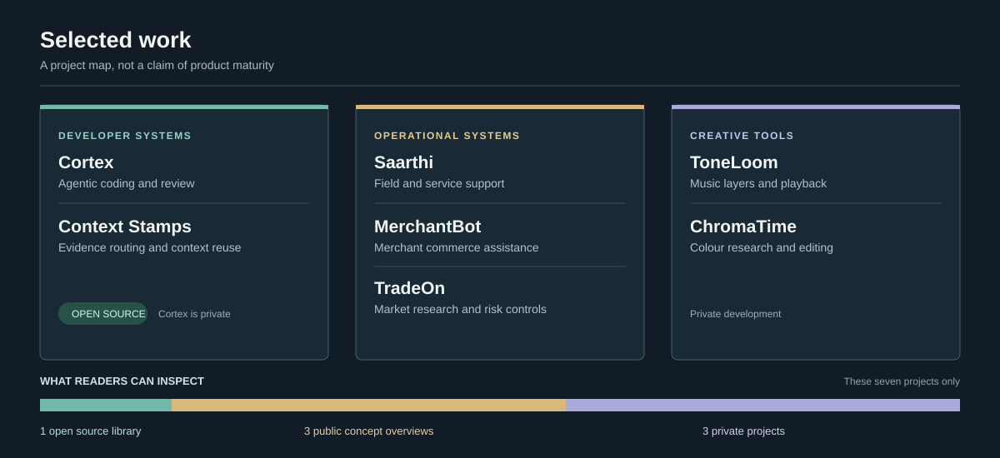

# Prashant Jagtap

I build applied AI and software products across developer tools, financial workflows, and creative applications. I am interested in what happens after a model gives an answer: whether the system had the right context, whether the action was justified, and whether a person can inspect or correct it.

Some of this work is open source. Several projects are private, so the descriptions here focus on the problem and intended use rather than implementation details or claims of production readiness.

## Selected work

| Project | What I am trying to build | What you can see |
| --- | --- | --- |
| **[Context Stamps](https://github.com/jprbom/context-stamps)** | A small, portable context layer that helps agents find current, authorized evidence and carry it between steps with less repeated context. The 256-bit stamp points to evidence; it does not replace the evidence. | Open source code, tests, and benchmark records. Results include limitations and failed comparisons. |
| **Cortex** | A coding environment where agents can plan, change, test, and review software while keeping track of repository state and human approvals. The aim is to make longer development tasks easier to follow and verify. | Private development. |
| **[Saarthi](https://github.com/jprbom/saarthi-showcase)** | Support for field and service teams: understand an issue, consult the knowledge base, route the case, and bring in a person when needed. | Public concept overview; implementation is private. |
| **[MerchantBot](https://github.com/jprbom/MerchantBot-Showcase)** | A conversational workspace for neighborhood merchants to manage customer enquiries, products, orders, and daily operations. Better records may later support responsible finance workflows. | Public concept overview; implementation is private. |
| **ToneLoom** | A music tool for separating audio that a user is entitled to process into playable layers, then exploring and mixing those layers. | Private prototype. |
| **ChromaTime** | A non-destructive photo and colour workspace for studying camera-aware editing and historical visual looks while preserving originals and repeatable edit recipes. | Private research and development. |
| **[TradeOn](https://github.com/jprbom/tradeon-public-diagrams)** | A market research and trading workspace that brings data, strategy experiments, and risk checks into one reviewable decision process. | Public concept overview; strategy and implementation remain private. |

The common thread is **context before action**. In a codebase, a support case, a merchant conversation, or an edit session, the system should know what information it used, what it does not know, and when to ask for review. I test these ideas against simpler approaches and keep the failures visible.

Context Stamps is the public library in this group. The other links are portfolio descriptions of private work; they are not offers to reuse the underlying code. Project status and licensing live in each repository.
